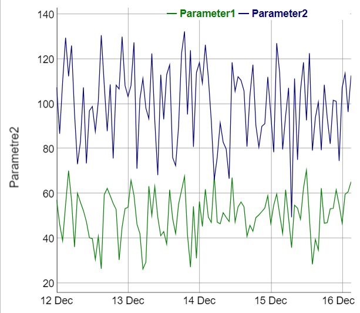

T.C. Çevre Şehircilik ve İklim Değişikliği bakanlığının ülke genelinde yaptığı hava kalitesi
ölçümleri [https://sim.csb.gov.tr/Services/AirQuality](https://sim.csb.gov.tr/Services/AirQuality) adresinde bulunan web uygulamasında istasyon bazında görsellenebilmektedir. 

Ham veriler ise [https://sim.csb.gov.tr/STN/STN_Report/StationDataDownloadNew](https://sim.csb.gov.tr/STN/STN_Report/StationDataDownloadNew) adresinden *Excel* formatında indirlebilmektedir. 

## Egzersiz 1 - Veri ithali

**Doğduğunuz şehre** ait olan **saatlik** hava kalitesi parametrelerini *Excel* formatında **doğduğunuz ay** için indirin. Tam bir aylık veri indirmeniz gerekmektedir.

Örnek :

- Mart ayında doğduysanız Mart 2023 verisi (Çünkü Mart 2024 bitmedi)
- Aralık ayında doğduysanız Aralık 2023 verisi
- Şubat ayında doğduysanız Şubat 2024 verisi

Yaratacağınız data.frame nesnesinin sütun isimleri Excel'de bulunan değişken sütun isimlerini içermelidir. *havaK* nesnesinin ilk 10 satırının raporda gözükmesini sağlayın.

```{r}
library(readxl)
havaK <- read_excel("C:\\Users\\User3456\\Desktop\\Veri Detayları3_28_2024, 2_07_53 PM.xlsx")
rapor <- head(havaK, 10)
print(rapor)
View(havaK)

```

## Egzersiz 2 - Veri Kalite Kontrolü

### Zaman sütunu
Zaman değerlerini içeren sütunun isminin **Time** olmasını sağlayın
```{r}
 names(havaK)[names(havaK) == "Tarih"] <- "Time"

```


*havaK$Time* adlı değişkendeki bütün verilerin **POSIXct** tipinde olmasını sağlayın. 

```{r}
# <kodu tamamla>

```

*Time* sütunu dışındaki bütün sütunların tipinin **numeric** olmasını sağlayın. *havaK* nesnesinin ilk 10 satırının raporda gözükmesini sağlayın.

```{r}
names(havaK)[names(havaK) == "Çanakkale"] <- "PM10"
names(havaK)[names(havaK) == "...3"] <- "PM2.5"
havaK$PM2.5 <- gsub(",",".",havaK$PM2.5)
havaK$PM10 <- gsub(",",".",havaK$PM10)
havaK$PM10 <- as.numeric(havaK$PM10)
havaK$PM2.5 <- as.numeric((havaK$PM2.5))
havaK <- havaK[-1,]
havaK[, -which(names(havaK) == "Time")] <- lapply(havaK[, -which(names(havaK) == "Time")], as.numeric)
rapor <- head(havaK, 10)
print(rapor)

```

## Egzersiz 3 - Veri Görselleme
*dygraphs* paketini kullanarak veri setinizde bulunan iki farklı parametreyi aynı grafik üzerinde iki değişik aks kullanarak (bkz örnek) çizin.




```{r}
library(dygraphs)
graph <- dygraph(havaK)
graph <- dyAxis(graph, "y", "Parametre1", label = "Parametre1")
graph <- dyAxis(graph, "y", "Parametre2", label = "Parametre2", independentTicks = TRUE)
graph <- dyOptions(graph, stackedGraph = FALSE)
graph

```
